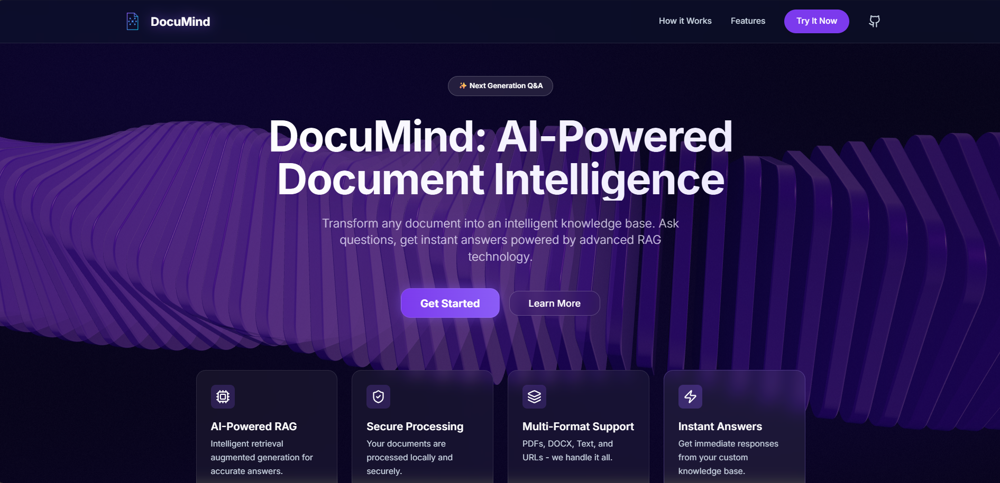

# DocuMind - AI Document Intelligence 🚀

DocuMind is a high-performance, real-time RAG (Retrieval-Augmented Generation) Q&A system designed to process documents and provides intelligent answers using state-of-the-art LLMs. Featuring a premium, modern UI with interactive elements and high-speed streaming responses.



## ✨ Features

- **Multi-Source Ingestion**: Process PDFs, DOCX files, plain text, and even URLs directly.
- **Real-Time Streaming**: Answers appear token-by-token for a seamless conversational experience.
- **Optimized Performance**: Model caching ensures near-instant response times after initial load.
- **Premium UI/UX**:
  - Independent scrolling columns (ChatGPT style).
  - Interactive 3D shader backgrounds.
  - Responsive design with smooth animations.
- **Robust Security**: API Token based authentication for LLM endpoints.


## ⛓️ DocuMind Pipeline Explanation (RAG Pipeline)


## 🛠️ Tech Stack

### Frontend
- **Framework**: React 19 + Vite
- **Styling**: Tailwind CSS 4.0
- **Animations**: Framer Motion
- **Visualization**: Three.js (Fiber)
- **Icons**: Lucide React

### Backend
- **Framework**: FastAPI
- **Orchestration**: LangChain
- **Vector Store**: FAISS
- **Embeddings**: sentence-transformers/all-MiniLM-L6-v2 (Cached)
- **LLM**: meta-llama/Llama-3.2-1B-Instruct (Cached via Novita)

## 🚀 Getting Started

### Prerequisites
- Python 3.9+
- Node.js 18+
- [Hugging Face API Token](https://huggingface.co/settings/tokens)

### Installation

1. **Clone the repository**
   ```bash
   git clone https://github.com/your-username/DocuMind.git
   cd DocuMind
   ```

2. **Setup Backend**
   ```bash
   cd backend
   pip install -r requirements.txt
   # Create a .env file and add your token
   echo "HUGGINGFACE_API_TOKEN=your_token_here" > .env
   ```

3. **Setup Frontend**
   ```bash
   cd ../frontend
   npm install
   ```

### Running the Project

1. **Start Backend Server** (from root directory)
   ```bash
   python -m uvicorn backend.main:app --reload --port 8000
   ```

2. **Start Frontend Server**
   ```bash
   cd frontend
   npm run dev
   ```

3. Open [http://localhost:5173/](http://localhost:5173/) in your browser.

## 📁 Project Structure

```text
DocuMind/
├── backend/            # FastAPI & RAG Engine
│   ├── main.py         # API Endpoints
│   └── rag_engine.py   # Vector store & LLM logic
├── frontend/           # React & Vite
│   ├── src/
│   │   ├── components/ # UI Components
│   │   └── App.tsx     # Main application
└── screenshots/        # Project documentation assets
```

## 🤝 Contributing
Contributions are welcome! Please feel free to submit a Pull Request.

## 📄 License
This project is licensed under the MIT License - see the LICENSE file for details.

---

Built with ❤️ for better document understanding.
